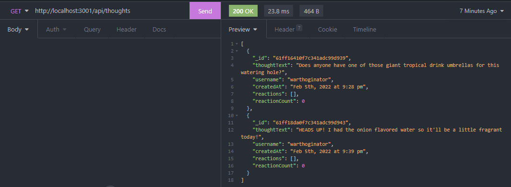
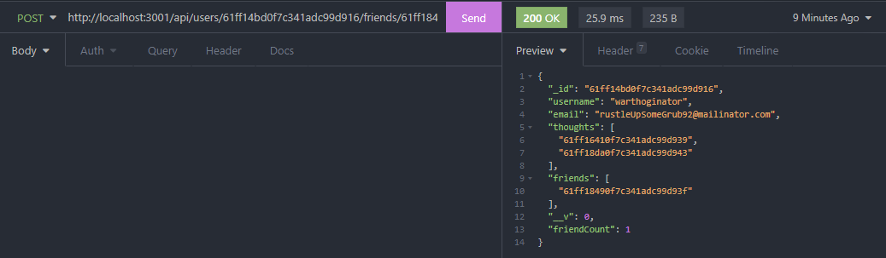
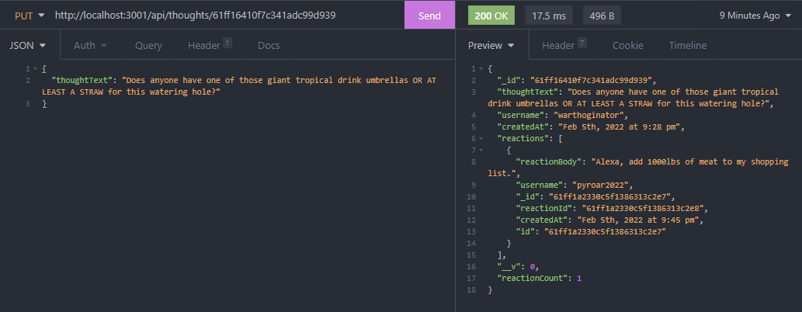

# the-watering-hole

## Description
The Watering Hole is an API for a social network web app allowing users to share their thoughts via posts as well as spark discussion on those thoughts through responses (reactions) to those posts. This also lets users create a friend list so others can see what their network is thinking about.

_App Sample Screenshots_

### Access

Check out the walkthrough video [here](https://watch.screencastify.com/v/eA7UPPFOroHdMuN70yb6).

Alternatively, clone the repository then run npm start.

### Future Enhancements Roadmap

* add a front-end
* enhance utilization of friend-list with suggestions or notifications of posts by others in the list
